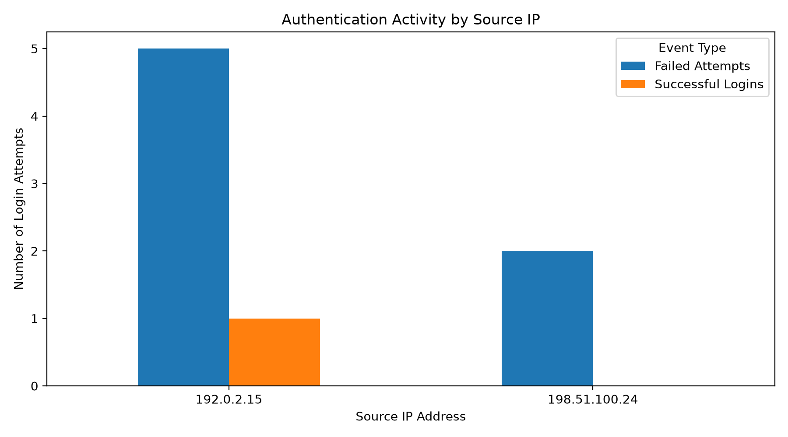

# 🔐 Security Log Analyzer

A Python-based cybersecurity project that analyzes authentication logs, detects suspicious login activity, correlates failed and successful authentication events, and generates security reports and visualizations.

## ✨ Features

- Parses SSH authentication logs
- Detects failed and successful login attempts
- Extracts usernames and source IP addresses
- Identifies the most targeted user accounts
- Classifies suspicious activity using severity levels:
  - `LOW`
  - `MEDIUM`
  - `HIGH`
  - `CRITICAL`
- Detects repeated failed logins followed by a successful login
- Exports findings to CSV
- Performs basic security analytics with Pandas
- Generates authentication activity visualizations with Matplotlib
- Supports command-line log file input using `argparse`

---

## 🧠 Detection Logic

The analyzer uses rule-based detection to classify authentication activity.

| Severity | Detection |
|---|---|
| LOW | Fewer than 3 failed login attempts |
| MEDIUM | 3–4 failed login attempts |
| HIGH | 5 or more failed login attempts |
| CRITICAL | 5+ failed attempts followed by a successful login |

> These thresholds were created for this educational lab and are not intended to represent universal SOC detection standards.

---

## 📊 Example Analysis

```text
=== SECURITY LOG ANALYSIS ===

Total failed logins: 7
Total successful logins: 2

Top IP addresses with failed logins:
192.0.2.15: 5 failed attempts
198.51.100.24: 2 failed attempts

=== SECURITY ALERTS ===
[CRITICAL] 192.0.2.15: 5 failed login attempts
[LOW] 198.51.100.24: 2 failed login attempts

=== CORRELATED SECURITY EVENTS ===
[CRITICAL] 192.0.2.15: 5 failed login attempts followed by a successful login

=== MOST TARGETED USERS ===
admin: 3 failed attempts
root: 2 failed attempts
test: 1 failed attempt
guest: 1 failed attempt
```

---

## 📈 Visualization

The project uses Pandas and Matplotlib to visualize authentication activity by source IP.

<p align="center">
  
</p>

---

## 📄 Generated Security Report

The analyzer exports findings to:

```text
output/security_report.csv
```

Example:

| IP Address | Failed Attempts | Successful Logins | Severity | Correlated Event |
|---|---:|---:|---|---|
| 192.0.2.15 | 5 | 1 | CRITICAL | YES |
| 198.51.100.24 | 2 | 0 | LOW | NO |

---

## 📁 Project Structure

```text
security-log-analyzer/
│
├── docs/
│   └── detection_logic.md
│
├── logs/
│   └── sample_auth.log
│
├── output/
│   ├── security_report.csv
│   └── security_activity_by_ip.png
│
├── src/
│   ├── log_analyzer.py
│   └── visualize_reports.py
│
├── .gitignore
├── LICENSE
├── README.md
└── requirements.txt
```

---

## 🛠️ Technologies

- Python
- Regular Expressions (`re`)
- `collections.Counter`
- `argparse`
- CSV
- Pandas
- Matplotlib
- Git & GitHub

---

## 🚀 Installation

Clone the repository:

```bash
git clone https://github.com/FaizahIbrahim/security-log-analyzer.git
```

Move into the project:

```bash
cd security-log-analyzer
```

Install dependencies:

```bash
pip install -r requirements.txt
```

---

## ▶️ Usage

Run the analyzer with the included sample log:

```bash
python src/log_analyzer.py
```

Or provide another compatible authentication log:

```bash
python src/log_analyzer.py logs/sample_auth.log
```

View available command-line options:

```bash
python src/log_analyzer.py --help
```

Generate the visualization:

```bash
python src/visualize_reports.py
```

---

## 🎯 What I Learned

Through this project, I practiced:

- Parsing structured security logs with Python
- Using regular expressions to extract authentication events
- Aggregating security data using `Counter`
- Creating rule-based detection logic
- Correlating multiple security events
- Generating CSV security reports
- Analyzing data with Pandas
- Visualizing findings with Matplotlib
- Building a basic command-line security tool

This project also helped me understand how authentication logs can be transformed into useful information for defensive security analysis.

---

## ⚠️ Disclaimer

This project is intended for educational and defensive cybersecurity purposes.

The included log data is synthetic and uses documentation/example IP address ranges.

---

## 📜 License

This project is licensed under the MIT License.
